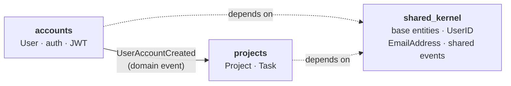
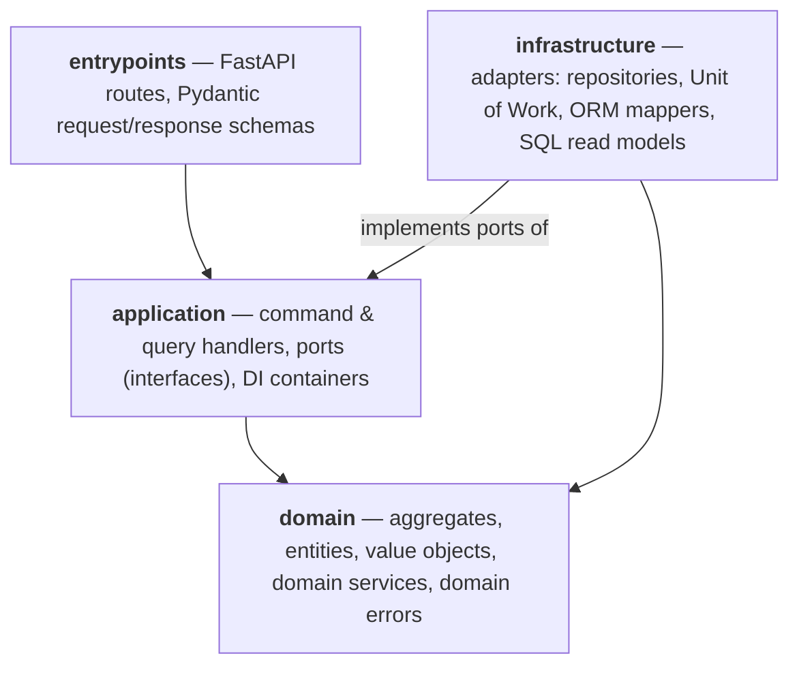
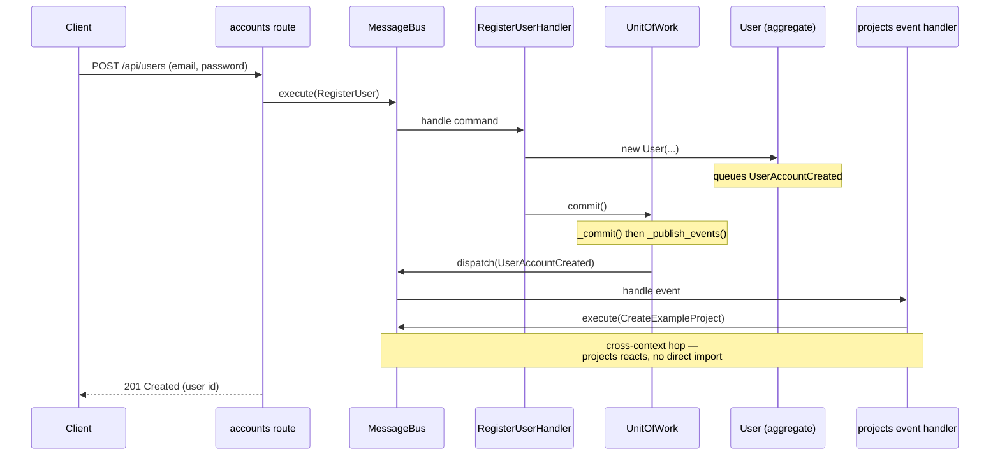

# Python DDD + Clean Architecture sandbox

A small **task-management API** (users, projects, tasks) used as a playground for one question:

> How do you combine **Domain-Driven Design** and **Clean / Hexagonal Architecture** with modern,
> idiomatic Python tooling — FastAPI, SQLAlchemy 2.0, Pydantic — without the domain rotting into
> framework glue?

> [!WARNING]
> **This is a proof-of-concept / research project, not a production-ready application.**
> It exists to explore patterns and trade-offs, not to be deployed. Several things a real
> system needs are intentionally simplified or missing — see
> [What's deliberately simplified](#whats-deliberately-simplified).

The design is **heavily inspired by [_Architecture Patterns with Python_ (cosmicpython.com)](https://www.cosmicpython.com/)**
by Harry Percival & Bob Gregory, plus the DDD canon listed at the [end](#books-that-inspired-this-project).
If you've read that book, most of the building blocks here will look familiar — repositories, unit of
work, a message bus, aggregates with domain events, and ports & adapters.

---

## Table of contents

- [Tech stack](#tech-stack)
- [Architecture at a glance](#architecture-at-a-glance)
  - [Bounded contexts](#bounded-contexts)
  - [How the contexts talk to each other](#how-the-contexts-talk-to-each-other)
  - [Layers inside a context](#layers-inside-a-context)
  - [Directory layout](#directory-layout)
  - [Following one request end to end](#following-one-request-end-to-end)
  - [Building blocks](#building-blocks)
- [What's deliberately simplified](#whats-deliberately-simplified)
- [Getting started](#getting-started)
- [Linting and testing](#linting-and-testing)
- [Other useful commands](#other-useful-commands)
- [Books that inspired this project](#books-that-inspired-this-project)
- [Other valuable resources](#other-valuable-resources)

---

## Tech stack

| Concern | Choice |
| --- | --- |
| Tooling / environment | [**uv**](https://docs.astral.sh/uv/) — manages the Python 3.14 toolchain, dependencies, and the lockfile |
| Language | **Python 3.14** (PEP 695 generics, PEP 604 `X \| None` unions, deferred annotations) |
| Web framework | **FastAPI** + **Uvicorn** |
| Validation / settings | **Pydantic v2** + **pydantic-settings** |
| Persistence | **SQLAlchemy 2.0** — Core tables + *imperative ("classical") mapping*; both sync and async engines |
| Database | **SQLite** (async access via `aiosqlite`) |
| Auth | **PyJWT** (bearer tokens) + **bcrypt** (hashing), OAuth2 password flow |
| Dependency injection | [**dependency-injector**](https://python-dependency-injector.ets-labs.org/) |
| CLI / seeding | **Typer** |
| Tests | **pytest** (+ `pytest-asyncio`, `pytest-cov`, `pytest-watch`, `freezegun`, `httpx`) |
| Lint / format | [**Ruff**](https://docs.astral.sh/ruff/) |
| Type checking | [**ty**](https://github.com/astral-sh/ty) (Astral's type checker) |

---

## Architecture at a glance

The codebase is organized into **bounded contexts** (the DDD term for a self-contained slice of the
domain with its own model and language). Each context is a Python package under `app/modules/` and is
internally split into the classic Clean Architecture layers.

### Bounded contexts

There are two business contexts plus a shared kernel:

| Context | Responsibility | Aggregate root |
| --- | --- | --- |
| **`accounts`** | User registration, authentication (JWT), changing email | `User` |
| **`projects`** | Projects and their tasks: create / archive / delete projects, add / complete tasks, task-count rules | `Project` (with nested `Task` entities) |
| **`shared_kernel`** | Concepts both contexts agree on: base `AggregateRoot` / `Entity` / `ValueObject`, the `UserID` and `EmailAddress` value objects, and the cross-context `UserAccountCreated` event |



A deliberate constraint: **`accounts` and `projects` never import each other.** The only things they
share are `shared_kernel` and the in-process message bus (`app/shared/message_bus.py`). That keeps the
contexts decoupled and forces all cross-context interaction through explicit, well-defined messages.

### How the contexts talk to each other

Communication happens through **domain events on an in-process message bus** — the in-memory equivalent
of "integration events" between services.

1. When a `User` is constructed, the aggregate **queues** a `UserAccountCreated` event
   (`app/modules/accounts/domain/user.py`). This event type lives in `shared_kernel`, so it's a shared
   contract rather than something `accounts` owns privately.
2. The Unit of Work **publishes** queued events to the bus *after* the database transaction commits
   (`commit()` → `_commit()` then `_publish_events()`, see
   `app/modules/.../application/ports/abstract_unit_of_work.py`).
3. The `projects` context **subscribes** to `UserAccountCreated` and reacts by issuing its own command —
   it creates a starter project for the new user
   (`CreateUserExampleProjectHandler` in `app/modules/projects/application/event_handlers.py`).

So `projects` reacts to something that happened in `accounts` **without either context knowing the other
exists**. The event is the contract; the bus is the wire.

### Layers inside a context

Every context follows the same dependency rule from Clean Architecture: **dependencies point inward,
toward the domain.** The domain knows nothing about the database, the web framework, or how it's wired.



- **`domain/`** — pure business logic. No SQLAlchemy, no FastAPI. Aggregates enforce their own invariants.
- **`application/`** — use cases. Command/query handlers orchestrate the domain and declare what they need
  from the outside world as **ports** (abstract interfaces): `AbstractUserRepository`,
  `AbstractUnitOfWork`, `AbstractPasswordHasher`, …
- **`infrastructure/`** — **adapters** that implement those ports with real technology (SQLAlchemy
  repositories, the bcrypt hasher, JWT auth) plus the imperative ORM mappers and read-side SQL.
- **`entrypoints/`** — the HTTP edge: FastAPI routers and Pydantic schemas. Routes translate HTTP into
  commands/queries and hand them to the bus.

### Directory layout

Both contexts share the same shape. Here's `accounts` annotated (and `projects` is structurally identical):

```
app/
├── __init__.py                     # FastAPI app factory (create_app)
├── config.py                       # Pydantic settings
├── seed.py                         # Typer seeding CLI
├── infrastructure/
│   ├── db.py                       # sync + async SQLAlchemy engines
│   ├── tables.py                   # Core table definitions (users, projects, tasks)
│   └── base_sql_query_handler.py   # async read-model base class
├── shared/
│   ├── message_bus.py              # Command/Event base types + MessageBus
│   └── base_schema.py              # Pydantic base
└── modules/
    ├── shared_kernel/              # base entities, UserID, EmailAddress, shared events
    ├── accounts/
    │   ├── domain/                 # User aggregate, Password VO, domain errors
    │   ├── application/
    │   │   ├── commands/           # RegisterUser, ChangeUserEmailAddress (+ handlers)
    │   │   ├── ports/              # Abstract repository / UoW / password hasher
    │   │   ├── queries.py          # read-side query definitions
    │   │   ├── event_handlers.py   # reactions to domain events
    │   │   ├── containers.py       # dependency-injector container
    │   │   └── testing/            # in-memory fakes (fake repo, fake UoW, …)
    │   ├── infrastructure/
    │   │   ├── adapters/           # SQLAlchemy repository, UoW, bcrypt hasher, JWT auth
    │   │   ├── queries.py          # SQL read-model handlers
    │   │   └── mappers.py          # imperative ORM mapping (domain ↔ table)
    │   ├── entrypoints/            # FastAPI routes + Pydantic schemas
    │   └── bootstrap.py            # wires the container into the bus
    └── projects/                   # same layout (Project/Task domain, more commands)
```

### Following one request end to end

Registration (`POST /api/users`) is the most illustrative path because it crosses a context boundary.
Notice that **the route never touches the domain or the database directly** — it only speaks to the bus.



Reads take a different path. Following **CQRS**, queries skip the aggregates and the Unit of Work
entirely and go through dedicated async **read-model handlers** that issue plain SQLAlchemy `select`s and
return flat DTOs (`app/modules/*/infrastructure/queries*`). Writes go through the domain; reads go
straight to the data.

### Building blocks

If you've read _Architecture Patterns with Python_, this is the same vocabulary:

- **Aggregates & entities** — `User`, `Project` (with child `Task` entities). Aggregates are the
  consistency boundary and the only things repositories load/save.
- **Value objects** — `UserID`, `EmailAddress`, `Password`. Immutable, compared by value.
- **Domain events** — queued on the aggregate, published by the Unit of Work after commit.
- **Repository** — one per aggregate, behind an abstract port. A *tracking* wrapper records which
  aggregates were touched so the UoW knows whose events to publish.
- **Unit of Work** — owns the transaction boundary (`commit` / `rollback`) and publishes domain events.
- **Message bus** — `execute(command)` routes to exactly one command handler; `dispatch(event)` fans out
  to zero-or-more event handlers (`app/shared/message_bus.py`).
- **Ports & adapters** — application declares interfaces; infrastructure (and the test suite's fakes)
  provide implementations.
- **Imperative ("classical") ORM mapping** — domain classes are plain Python with no ORM base class or
  columns; SQLAlchemy is told how to map them to Core tables in `infrastructure/mappers.py`. This is what
  keeps the domain framework-free. One sharp edge worth knowing: SQLAlchemy bypasses `__init__` when
  rehydrating an object from the DB, so a `load` event listener re-initializes the events list.

---

## What's deliberately simplified

Because this is a learning sandbox, several production concerns are intentionally cut or stubbed. Calling
them out is part of the point — it's where the interesting trade-offs live:

- **The message bus is in-process and synchronous.** Events are handled in the same Python process, in
  the same request. There's no broker (Kafka/RabbitMQ), no retries, no dead-lettering.
- **No cross-context atomicity / no outbox.** Events publish *after* the transaction commits. If a
  downstream event handler fails, the upstream write is already committed — there's no outbox pattern or
  eventual-consistency machinery to reconcile it. Fine for a demo, not for real integration.
- **One shared SQLite database** for both contexts. A stricter design would give each context its own
  schema or database; here they share tables in a single file.
- **No migrations.** The schema is created from SQLAlchemy metadata at startup (no Alembic).
- **Imperative mapping has a cost.** Keeping the domain ORM-free buys purity but adds mapping boilerplate
  and a couple of SQLAlchemy gotchas (see the `load` listener above).
- **Auth is minimal.** JWTs with a static secret, no refresh tokens, no rotation, no rate limiting.
- **Observability, deployment, security hardening, and pagination** are out of scope.

---

## Getting started

- Install [uv](https://docs.astral.sh/uv/) — it manages the Python 3.14 toolchain and dependencies
- `uv sync` — creates `.venv` from `uv.lock`, installing Python 3.14 if needed
- `make seed` — seed the database
- `make server-dev` — run the API with autoreload

Then open:

- Swagger UI: http://localhost:8000/api/docs
- API root: http://localhost:8000/docs

Try it from the command line:

```bash
# register a user
curl http://localhost:8000/api/users -X POST \
  -H "Content-Type: application/json" \
  -d '{"email": "test@email.com", "password": "password"}' --silent

# read a project's tasks
curl http://localhost:8000/api/projects/1/tasks --silent | jq
```

## Linting and testing

- `make lint-all` — `ty` type check + Ruff lint + format check
- `make format` — Ruff format + autofix
- `make test` — unit tests
- `make test-watch` — re-run unit tests on change
- `make test-integration` / `make test-end-to-end` — wider test layers
- `make test-all` — everything

## Other useful commands

- `uv pip list --outdated` — show outdated dependencies
- `uv lock --upgrade` — refresh the lockfile to the latest compatible versions

---

## Books that inspired this project

- ⭐ [Architecture Patterns with Python](https://www.cosmicpython.com/) — the primary influence
- [Clean Architecture: A Craftsman's Guide to Software Structure and Design](https://www.amazon.com/Clean-Architecture-Craftsmans-Software-Structure/dp/0134494164)
- [Domain-Driven Design: Tackling Complexity in the Heart of Software](https://www.amazon.com/Domain-Driven-Design-Tackling-Complexity-Software/dp/0321125215)
- [Domain-Driven Design Distilled](https://www.amazon.com/Domain-Driven-Design-Distilled-Vaughn-Vernon/dp/0134434420)
- [Implementing Domain-Driven Design](https://www.amazon.com/Implementing-Domain-Driven-Design-Vaughn-Vernon/dp/0321834577)

## Other valuable resources

- [Cosmic Python — talk on YouTube](https://www.youtube.com/watch?v=Ru2T4fu3bGQ)
- [FastAPI Best Practices and Conventions](https://github.com/zhanymkanov/fastapi-best-practices)
